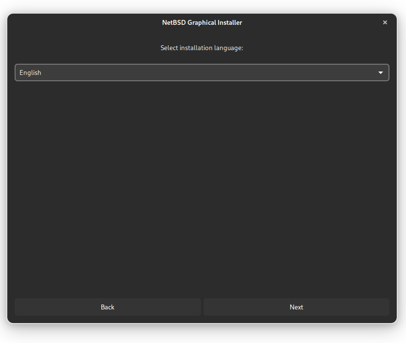

<h1 align=center> What is EzNetBSD? </h1>
<br>

<div align = center> 
<a href="https://github.com/Nam4ik/EasyNetBSD"> 
  
</a>
<br> 
<br> 
 


<a href="https://www.netbsd.org/">
  
</a>

</div>

<br>

**EzNBSD** - C-written free toolkit to make NetBSD more user-friendly.

In my opinion, NetBSD is an extremely useful system for both ancient hardware and simple use, even if it is inferior to OpenBSD/FreeBSD on the desktop. 
I believe that you need to try everything and choose the best for yourself. There are no bindings or tools in NetBSD for easy use and installation. 
The most difficult part of the installation is network problems. These tools will allow you to install NetBSD using the graphical interface (gtk+-3.0), install 
the basic packages, DE, and save you the pain of setting up WIFI. 

> [!WARNING]
> Work in progress.

<br> 
<h1 align=center> How to use? </h1>
<br>
<br>

Download `.iso` for your architecture from **[releases page](https://github.com/Nam4ik/EasyNetBSD/releases)** it is _fork_ of official NetBSD image with custom core (integrated wifi drivers). After this write `.iso` to the USB flash with 

```bash
sudo dd if=/path/to/iso of=/dev/yourUSB bs=4M status=progress
```

Or use graphical interface like [balena etcher](https://etcher.balena.io/) or [gnome disks](https://gitlab.gnome.org/GNOME/gnome-disk-utility).  

After you boot from this USB stick, you will have a standard GTK3+ interface. It's intuitive and looks something like this (first build, may change slightly):

<div align=center> 
 
</div>


